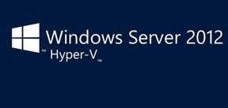

#对 Windows 10 超 V

超 V 允许您运行多个操作系统同时在同一台计算机上的 32 位或 64 位 x 86。
而不是直接在计算机的硬件上运行，操作系统运行在一个虚拟机 (VM)。

hello
Hyper-V in Windows is sometimes referred to as Client Hyper-V.

**重要:**您必须授权每个根据其操作系统要求来宾虚拟机上运行的软件。

对 Windows 10 超 V

这里有几个链接到其他版本的超五

*   [超 V 上 Windows 服务器 2016年技术预览](https://technet.microsoft.com/en-us/library/mt126117.aspx)
*   [Windows 服务器 2012 R2 上超 V](https://technet.microsoft.com/en-us/library/hh831531.aspx)
*   [微软 Hyper-V 服务器](https://technet.microsoft.com/library/hh923062.aspx)

对 Windows 10 超 V

chnet.microsoft.com/library/hh923062.aspx)

Hyper-V on Windows 10
